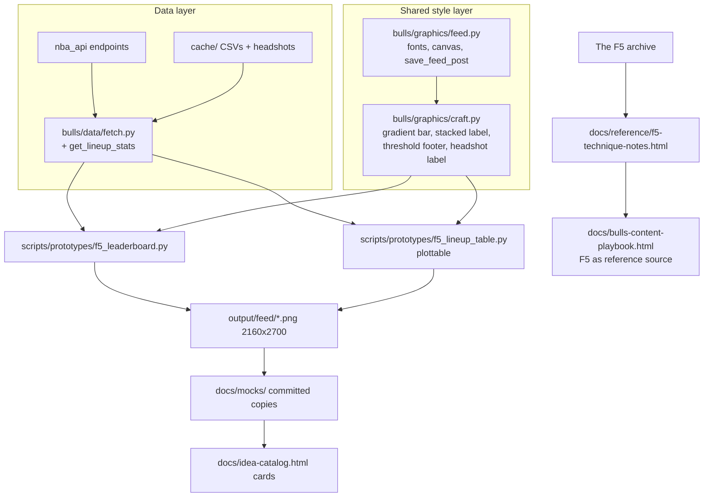

# F5 Content System Expansion - Plan

## Goal Capsule

- **Objective:** Adopt The F5 (Owen Phillips) as a reference source for the Bulls content system — capture his technique knowledge in docs, add Bulls-ified idea cards to the catalog, and build two new post formats (eye-candy leaderboard, polished stat/lineup table) in code.
- **Product authority:** The account owner (@chicagobullsdata), via the brainstorm dialogue recorded in this artifact. `docs/bulls-content-playbook.html` remains the visual north star; this plan extends it, not replaces it.
- **Authority hierarchy:** This plan > repo conventions in `CLAUDE.md`/`AGENTS.md` > implementer judgment. Product Contract changes require the owner; implementation detail is the implementer's.
- **Stop conditions:** Stop and surface rather than guess if (a) `plottable` cannot render an acceptable table and the named fallback also fails, or (b) NBA API lineup data is unavailable in a form that supports the table format.
- **Tail ownership:** Judging "visibly sharper" against existing mocks stays with the owner after landing; the plan's Definition of Done covers everything up to that judgment.

---

## Product Contract

Product Contract preservation: unchanged in substance — R1–R8 and AE1–AE2 preserved verbatim; the brainstorm's "Deferred to planning" questions are resolved into Planning Contract decisions; the Dependencies section is updated in place to reflect those resolutions.

### Summary

Bring The F5's craft into the Bulls content system in three connected pieces: a distilled techniques reference plus playbook and catalog expansion, then an eye-candy leaderboard builder (first, so the next post is visibly sharper), then a polished stat/lineup table builder as the reusable "ask anytime" capability. Bulls brand identity, F5 structural craft, Python only.

### Problem Frame

The playbook's default grammar is boards, tables, grids, and shared-scale comparisons, but the code can currently produce only court maps and basic matplotlib charts — there is no table-rendering capability at all. The F5's archive (~75 tutorials, 2020–2025) covers exactly those formats with working code, and the owner's Instagram saved collection confirms the taste match (Z-Bounders leaderboard, Doubling Up lineup table, Net Rating by Day, catch-and-shoot grid are all F5 saves).

Two timing pressures: the newsletter ended in August 2025 and its tutorials sit behind a paywall the owner currently has access to, so the knowledge should be captured now; and the owner is non-technical, so output quality must come from patterns encoded in the repo rather than per-post handcrafting.

### Key Decisions

- **Bulls brand, F5 structure.** Keep Playfair Display / DM Sans, Bulls red accents, and the 4:5 portrait format; adopt his structural craft (headshots and logos as data labels, gradient-scaled stat columns, stacked player+context labels, thresholds printed on the graphic). The Instagram grid stays visually coherent.
- **Python only.** No R toolchain. His visual quality comes from design patterns, not the language — his own tutorials produce identical output in both. Use Python twins where they exist and matplotlib techniques elsewhere. Revisit only if a future format is R-only and expensive to recreate.
- **Leaderboard before table.** The leaderboard needs no new library, so the "next post visibly sharper" payoff lands first; the table is the larger capability build.
- **Distill, don't copy.** Technique notes are written in our own words with links back to source posts. No reproduction of paywalled articles — both copyright-safe and durable if archive access lapses.

### Requirements

**Knowledge capture (docs)**

- R1. A techniques reference in `docs/reference/` distills F5 craft patterns in our own words, each pattern linked to its source post URL (precedent: `docs/reference/savvas-shot-charts-tutorial.html`).
- R2. The content playbook (`docs/bulls-content-playbook.html`) adds The F5 as a reference source alongside Basketball University and Kirk Goldsberry, stating what we take from it and how it maps to the existing grammar and fairness guardrails.
- R3. The idea catalog (`docs/idea-catalog.html`) gains Bulls-ified F5-derived cards: the two selected formats plus five more as Parked, each pruneable by the owner.

**New formats (code)**

- R4. An eye-candy leaderboard builder: top-N Bulls players on one stat, with headshots, gradient stat bars, stacked name/context labels, and the qualification threshold visible on the graphic.
- R5. A polished stat/lineup table builder: color-scaled rating columns, logos and headshots in cells, stacked labels, and visible thresholds and coverage window — reusable so future table requests change only data and text, not chart code.
- R6. Both formats use Bulls brand fonts and colors at 4:5 portrait, exported at higher resolution than the current 1080×1350 so text survives Instagram compression.
- R7. The craft techniques land as shared, reusable pieces available to future post builders, not one-off code inside a single script.

**Process**

- R8. Each new format follows the existing prototype-script-first workflow: a prototype script in `scripts/prototypes/`, a PNG mock, and a catalog card with its image copied to `docs/mocks/`; promotion into `bulls/graphics` happens only when the format repeats.

### Acceptance Examples

- AE1. **Covers R4, R6, R7.** Given the leaderboard builder exists, when the owner asks for "top 10 Bulls in points per game this season," then a 4:5 PNG with headshots, gradient bars, and a visible minimum-games threshold is produced without writing new plotting code.
- AE2. **Covers R5, R6, R7.** Given the table builder exists, when the owner asks for "our most-used lineups and their net ratings," then a branded table PNG with color-scaled net-rating column and visible coverage window is produced the same way.

### Success Criteria

- The next posted graphic (leaderboard format) is visibly sharper than current output, judged by the owner side-by-side against an existing mock.
- After both formats land, a new leaderboard or table post is producible on request with only data and copy changes.
- The fairness guardrails (visible thresholds, coverage window, source line) appear on every generated graphic by default rather than by per-post effort.

### Scope Boundaries

- No R toolchain (hoopR, ggplot2, gt) — Python only.
- No automation or pipelines (his GitHub Actions tutorial stays parked) — existing repo rule.
- No wholesale clone of the F5 aesthetic (floralwhite/Roboto).
- No verbatim copying of paywalled F5 articles into the repo.
- Instagram access stays read-only; no posting automation.

#### Deferred to Follow-Up Work

- Restyling existing zone/court graphics with the shared craft helpers and higher export resolution.
- Promoting the two prototype builders into `bulls/graphics` + `scripts/` CLIs once the formats repeat (per R8).

### Dependencies / Assumptions

- Verified: no table-rendering library exists in `requirements.txt` today; `plottable` is added by this plan (decision and fallback in Planning Contract).
- `nba_api` (already in the repo) supplies lineup data via its lineup dashboard endpoints; pbpstats.com's free JSON API is the documented fallback, not a dependency.
- The owner currently has paid access to the F5 archive; R1 capture happens while that holds.
- F5's GitHub-hosted assets (square team logos, datasets) are third-party and could disappear; anything we use gets cached locally like headshots already are.

### Outstanding Questions

**Deferred to execution**

- Which stat/topic the first real leaderboard post uses — owner's content choice at generation time; the prototype defaults to points per game so the mock is reviewable.
- Which of the five Parked cards the owner prunes — cards land as proposals; pruning is a one-click edit after review.

### Sources / Research

- F5 tutorial index (all ~75 tutorials): https://thef5.substack.com/p/r-tutorials — newsletter ended 2025-08-21, archive stable.
- Tutorials read in full: How To Create Instagram Eye Candy, How To Make Great Tables In Python, How To Make More Great Tables in R and Python, How To Make Beautiful Big Boards, How to make small multiple charts in R and Python, How To Make A NBA Jam Style Small Multiple.
- His Python stack observed: `nba_api`, `polars`, `great_tables` + `gt-extras`, `plotnine`; R-only helpers whose effects transfer to matplotlib: `ggpath`, `shadowtext`, `ggchicklet`, `paletteer`.
- Owner's Instagram saved collection (curated F5 and adjacent posts) — the taste evidence behind the format choices.
- His datasets and image assets: https://github.com/Henryjean/data (square NBA logos, tutorial datasets); pbpstats API pattern: `https://api.pbpstats.com/get-totals/nba`.
- Repo grounding: playbook grammar and guardrails (`docs/bulls-content-playbook.html`), catalog structure (`docs/idea-catalog.html`, 7 cards + template), current stack (`requirements.txt`, `bulls/viz/charts.py`, `bulls/graphics/feed.py` — fonts, circular headshots, 1080×1350 @ 150 DPI), prototype workflow (`scripts/prototypes/impact_board.py` — cache-CSV input, house-style palette, two-view roster convention), headshot caching (`bulls/data/fetch.py`).
- Table library research: `great_tables` PNG export requires Selenium plus an installed browser (https://posit-dev.github.io/great-tables/reference/GT.save.html); `plottable` is matplotlib-native with color-mapped columns and images in cells (https://github.com/znstrider/plottable, https://plottable.readthedocs.io/en/latest/index.html).

---

## Planning Contract

### Key Technical Decisions

- **KTD1 — Table rendering via `plottable`, not `great_tables`.** `plottable` renders tables as matplotlib figures, so it reuses the repo's loaded Playfair/DM Sans fonts, Bulls colors, and `save_feed_post()` unchanged, and adds no runtime beyond one pip package. `great_tables` (highest fidelity to the source tutorials) is rejected: its PNG export requires Selenium plus an installed browser, and its HTML/CSS rendering bypasses the repo's font pipeline. **Fallback:** if `plottable` proves incompatible with the repo's matplotlib pin, render the table manually in the board style of `scripts/prototypes/impact_board.py` — the repo already hand-draws board layouts, and a table is a stricter grid of the same elements.
- **KTD2 — New shared craft module `bulls/graphics/craft.py`.** The F5 techniques (gradient stat bar, stacked name/context label, threshold-and-coverage footer, headshot-as-label placement) land as small tested helpers shared from day one, satisfying R7 without violating the prototype-first workflow: the *post builders* stay in `scripts/prototypes/` until formats repeat; the *craft vocabulary* is shared immediately, like `_fp_title`/`_make_circular_headshot` already are.
- **KTD3 — Export at `dpi=300` (2160×2700) for the new prototypes.** `save_feed_post(fig, path, dpi=...)` already parameterizes DPI; the canvas stays 4:5. Existing builders keep 150 DPI (deferred follow-up), so no regression risk.
- **KTD4 — Lineup data from `nba_api` lineup dashboards.** Add `get_lineup_stats()` to `bulls/data/fetch.py` using the league/team lineup dashboard endpoint (2-man groups, Bulls team filter, advanced measure type for minutes + off/def/net rating — the default Base measure omits the rating columns), honoring the configured API delay like every other fetch wrapper. pbpstats.com stays a documented fallback only.
- **KTD5 — Technique notes as hand-authored HTML.** `docs/reference/f5-technique-notes.html`, matching the repo's authored-doc convention (playbook and catalog are HTML viewed in the browser). Own words plus source links; each pattern names the repo helper that implements it once U1 lands.

### Assumptions

- `plottable` installs and renders correctly against the repo's `matplotlib>=3.7`; U4 verifies this first and falls back per KTD1 if not.
- Live NBA API access is available during execution; cached CSVs under `cache/` are used where they already exist (leaderboard) so the mock is reproducible offline.
- The five Parked card selections are proposals standing in for the owner's pruning pass after landing.
- The leaderboard prototype follows the repo's two-view convention (all players + current roster) from `scripts/prototypes/impact_board.py`.

### High-Level Technical Design

---

## Implementation Units

### U1. Shared craft helpers module

- **Goal:** The F5 structural techniques exist as small reusable matplotlib helpers in the house style.
- **Requirements:** R7, R6 (threshold footer serves the fairness guardrails on every graphic).
- **Dependencies:** none.
- **Files:** `bulls/graphics/craft.py` (new), `bulls/graphics/__init__.py` (export), `tests/test_graphics.py` (extend).
- **Approach:** Four helpers, each taking an `Axes`/`Figure` plus data: `gradient_bar` (horizontal bar filled by a low→high colormap anchored on Bulls red), `stacked_label` (bold primary line + muted secondary line, matching the ink/muted palette in `scripts/prototypes/impact_board.py`; truncates the primary line past 16 characters to first-initial + last name, the existing impact_board.py rule, so U2 and U4 inherit identical name handling), `threshold_footer` (one-line qualification rule + coverage window + source, placed like existing footnotes), `headshot_label` (circular headshot via `_make_circular_headshot` placed as an axis annotation, with a neutral placeholder circle when the image is unavailable).
- **Patterns to follow:** Font loading and helper style in `bulls/graphics/feed.py` (`_fp_title`, `_fp_body`, `_make_circular_headshot`); palette constants in `scripts/prototypes/impact_board.py`.
- **Test scenarios:** gradient_bar maps the min value to the light end and max to the dark end of the colormap; threshold_footer output contains the threshold number and coverage window passed in; stacked_label renders two text objects with the primary above the secondary; stacked_label truncates a name longer than 16 characters to first-initial + last name; headshot_label with a nonexistent player id draws the placeholder instead of raising.
- **Verification:** `./run_tests.sh` green including the new tests; helpers importable as `from bulls.graphics.craft import ...`.

### U2. Eye-candy leaderboard prototype

- **Goal:** A generated Bulls leaderboard mock in the Z-Bounders structure with Bulls branding — the "next post" candidate.
- **Requirements:** R4, R6, R8. Covers AE1.
- **Dependencies:** U1.
- **Files:** `scripts/prototypes/f5_leaderboard.py` (new), `scripts/prototypes/README.md` (extend).
- **Approach:** Top-10 Bulls by points per game (default) from the cached season box scores (`cache/box_scores_2025-26.csv`), min-games threshold visible via `threshold_footer`, one row per player: `headshot_label` + `stacked_label` (name / context line) + `gradient_bar` + shadow-outlined value text. Two views per the roster convention (all players / current roster). Stat column and top-N are module constants so the owner's future topic changes are data-and-copy edits. Save at `dpi=300` to `output/feed/YYYY-MM-DD-f5-leaderboard-{scope}.png`.
- **Patterns to follow:** `scripts/prototypes/impact_board.py` end to end (cache input, minutes parsing, two views, output naming).
- **Test scenarios:** Test expectation: none — prototype script per the repo's prototype-first workflow; aggregation and rendering logic that repeats gets promoted into `bulls/` with tests at that point (R8).
- **Verification:** Script runs from the venv and writes both PNGs at 2160×2700; players below the min-games threshold absent; values spot-check against the cached box scores; threshold, coverage window, and source line legible on the image.

### U3. Lineup data access

- **Goal:** Bulls 2-man lineup stats available through the data layer like every other fetch.
- **Requirements:** R5 (data prerequisite).
- **Dependencies:** none (parallel to U1–U2).
- **Files:** `bulls/data/fetch.py` (add `get_lineup_stats`), `bulls/data/__init__.py` (export), `tests/test_data.py` (extend).
- **Approach:** Wrap the `nba_api` lineup dashboard endpoint (group quantity 2, Bulls team id from `bulls/config.py`, current season string, per-mode totals, advanced measure type — the endpoint's default Base measure returns no off/def/net rating columns; confirm the Advanced column names on the first live call), return a DataFrame with combo label, player ids, games, minutes, offensive/defensive/net rating; apply the configured API delay; accept a `min_minutes` filter parameter.
- **Patterns to follow:** Existing wrappers in `bulls/data/fetch.py` (roster, box scores) — same delay, same DataFrame-out shape, same test mocking style in `tests/test_data.py`.
- **Test scenarios:** mocked endpoint response yields the expected columns; `min_minutes` filters below-threshold lineups out; empty API response returns an empty DataFrame with the expected columns rather than raising; the season string comes from `bulls/config.py` not a literal.
- **Verification:** `./run_tests.sh` green; a live smoke call returns non-empty data for the Bulls (network permitting).

### U4. plottable dependency + lineup table prototype

- **Goal:** The Doubling Up-style Bulls lineup table renders as a branded 4:5 PNG — the reusable table capability.
- **Requirements:** R5, R6, R8. Covers AE2.
- **Dependencies:** U1, U3.
- **Files:** `requirements.txt` (add `plottable`), `scripts/prototypes/f5_lineup_table.py` (new), `scripts/prototypes/README.md` (extend).
- **Execution note:** Verify `plottable` compatibility first — install and render a minimal table against the repo's matplotlib before building the full layout; switch to the KTD1 fallback immediately if it fails.
- **Approach:** Most-used Bulls 2-man lineups by minutes (via U3, `min_minutes` visible in the footer), one row per combo: stacked player names, games, minutes, off/def rating, net rating color-scaled diverging around zero. Table title/subtitle in Playfair via figure-level text, `threshold_footer` for coverage window + source. Column set and colormap as module constants for reuse. Save at `dpi=300` to `output/feed/YYYY-MM-DD-f5-lineup-table.png`.
- **Patterns to follow:** plottable `ColumnDefinition` usage with `cmap` columns and text properties (see Sources); house palette from `scripts/prototypes/impact_board.py`.
- **Test scenarios:** Test expectation: none — prototype script per the repo's prototype-first workflow (U3 carries the tested logic).
- **Verification:** `venv/bin/pip install -r requirements.txt` succeeds; script writes the PNG at 2160×2700; net-rating colors diverge correctly around zero (negative red-shifted, positive toward Bulls-consistent dark); thresholds and coverage window legible.

### U5. F5 technique notes reference doc

- **Goal:** The F5 knowledge survives paywall/archive loss, in our own words, mapped to our code.
- **Requirements:** R1.
- **Dependencies:** U1 (so each pattern can name the repo helper implementing it).
- **Files:** `docs/reference/f5-technique-notes.html` (new).
- **Approach:** One entry per craft pattern (headshots/logos as data labels, gradient stat columns, stacked labels, visible thresholds, small multiples with shared scales, percentile bars, high-DPI 4:5 export, engagement-format anatomy), each with: what it is, when to use it per the playbook grammar, the source post URL, and the repo helper or prototype that implements it (or "not yet built"). Include his Python-stack mapping table (hoopR→nba_api etc.) and the pbpstats/GitHub asset pointers. Style: simple standalone HTML consistent with existing authored docs. No copied article text.
- **Patterns to follow:** Doc tone/structure of `docs/bulls-content-playbook.html`; reference-doc precedent `docs/reference/savvas-shot-charts-tutorial.html`.
- **Test scenarios:** Test expectation: none — docs-only.
- **Verification:** Opens in a browser; every source link points at a real F5 post URL; no verbatim paragraphs from paywalled posts.

### U6. Playbook update

- **Goal:** The playbook records The F5 as a reference source and the craft/export standards new graphics follow.
- **Requirements:** R2.
- **Dependencies:** U5 (links to the technique notes).
- **Files:** `docs/bulls-content-playbook.html`.
- **Approach:** Add The F5 to the reference-accounts section (positioning: structural craft + engagement formats, complementing Basketball University's density and Goldsberry's spatial work); note the two adopted formats and the craft standards (headshot labels, gradient columns, threshold footer as the default execution of the fairness guardrails, 2160×2700 export); link to `docs/reference/f5-technique-notes.html`; append a revision-history row (the playbook's convention for material updates).
- **Test scenarios:** Test expectation: none — docs-only.
- **Verification:** Renders correctly in a browser; revision-history row added; fairness-guardrails section untouched in substance.

### U7. Idea catalog cards + committed mocks

- **Goal:** The catalog shows the two new formats (Mocked) and five Bulls-ified F5 ideas (Parked).
- **Requirements:** R3, R8.
- **Dependencies:** U2, U4 (mock PNGs must exist).
- **Files:** `docs/idea-catalog.html`, `docs/mocks/` (two new PNGs copied from `output/feed/`).
- **Approach:** Using the in-file card template, newest first: two Mocked cards (F5 Leaderboard — points per game; Bulls Lineup Table — 2-man net ratings) with images copied to `docs/mocks/`; five Parked cards without images: Bulls Percentile Cards (NBA Jam-style category bars vs league), Headshot Stat-Card Grid (one big color-coded number per player), Season Trend Small Multiples (one mini-chart per player, shared scales), League Leaderboard with Bulls Highlight (niche-stat eye candy, Bulls player flagged), Availability Grid (games played/missed per player). Each card names insight, grammar, and source inspiration.
- **Patterns to follow:** Existing card markup and status chips in `docs/idea-catalog.html`.
- **Test scenarios:** Test expectation: none — docs-only.
- **Verification:** Catalog opens with 14 cards total (7 existing + 7 new); the two Mocked card images resolve from `docs/mocks/`; statuses correct.

### U8. Repo docs sync

- **Goal:** `README.md`, `CLAUDE.md`, and `AGENTS.md` reflect the new module, dependency, data function, and prototypes.
- **Requirements:** R8 (workflow documentation stays accurate — repo rule: update docs when behavior changes).
- **Dependencies:** U1–U7.
- **Files:** `README.md`, `CLAUDE.md`, `AGENTS.md`.
- **Approach:** Add `bulls/graphics/craft.py` helpers and `get_lineup_stats` to the API listings; add `plottable` to the stack notes; mention the 300-DPI export default for new prototypes; keep edits minimal and consistent with existing doc structure.
- **Test scenarios:** Test expectation: none — docs-only.
- **Verification:** The three docs mention the new helpers, data function, and dependency; no stale contradictions (e.g., "matplotlib-only" claims).

---

## Verification Contract

- `./run_tests.sh` (equivalently `venv/bin/python -m pytest tests/ -v`) passes — full suite including new `tests/test_graphics.py` and `tests/test_data.py` cases.
- `venv/bin/python scripts/prototypes/f5_leaderboard.py` writes two PNGs (all-players + roster views) at 2160×2700 to `output/feed/`.
- `venv/bin/python scripts/prototypes/f5_lineup_table.py` writes one PNG at 2160×2700 to `output/feed/` (requires network for lineup data).
- Visual gates on both mocks: Playfair/DM Sans render (not fallback fonts), qualification threshold + coverage window + source line legible, Bulls red present, 4:5 aspect.
- `docs/idea-catalog.html` and `docs/bulls-content-playbook.html` open in a browser with images resolving; no broken links to `docs/reference/f5-technique-notes.html`.

## Definition of Done

- All units U1–U8 complete; `./run_tests.sh` green.
- Both format mocks generated, visually gated, and committed to `docs/mocks/` with catalog cards (2 Mocked, 5 Parked).
- Technique notes, playbook update (with revision row), and repo docs sync landed.
- `plottable` pinned in `requirements.txt` and installable — or the KTD1 fallback implemented and the KTD/docs updated to say so.
- No abandoned experimental code in the diff (failed rendering attempts removed).
- Owner-facing tail (not blocking done): side-by-side sharpness judgment and Parked-card pruning happen after review.
